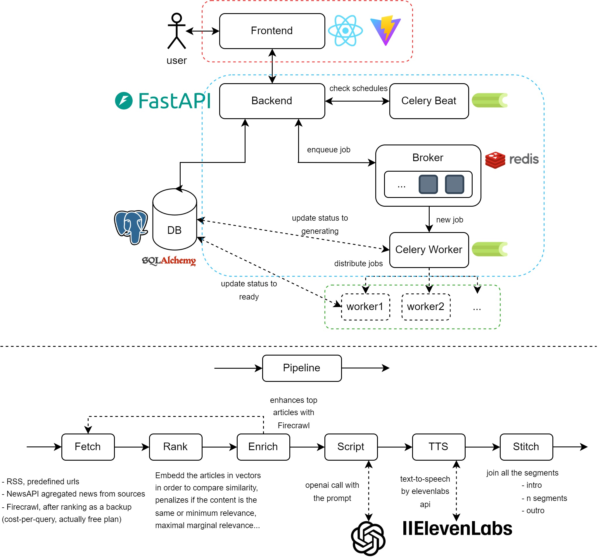

# Personal Podcast Generator

*disclaimer -> this project is part of a take-home assignment*

This app generates personalized news podcasts from a curated set of sources, on a user-configured schedule or on-demand. The main workflow is the following one: pulls news, ranks it against the listener's interests, drafts a script with GPT, synthesizes audio withElevenLabs, and stitches everything into an MP3.

## TL;DR setup

```bash
cp .env.example .env
# add OPENAI_API_KEY, ELEVENLABS_API_KEY, NEWSAPI_KEY, FIRECRAWL_API_KEY
docker compose up
```

Then:

- **Frontend:** http://localhost:5173
- **API + Swagger:** http://localhost:8000/docs
- **Admin metrics:** http://localhost:5173/admin

Configure topics + a schedule under `/preferences`. Click *Generate now* or
wait for the scheduled time (Celery Beat fires automatic generations).

## Architecture



Seven containers orchestrated by Compose: `postgres`, `redis`, `migrate`
(one-shot), `api`, `worker`, `beat`, `frontend`.

## Key decisions

### Separation: pipeline / api / worker

The core generation logic lives in its own Python package (`packages/pipeline/`), with zero dependencies on FastAPI, SQLAlchemy or Celery. It takes a `PipelineConfig` dataclass and returns a `PipelineResult`. The backend imports it as a local editable install.

Three callers use the same code:

1. The Celery worker (production path)
2. A CLI (`python -m pipeline ...` — useful for ad-hoc generation, prompt iteration, debugging)
3. Tests (no infra needed)

This was the first decision and the most important one. Generating a podcast takes 30–60s and binding that logic to the HTTP layer would have made everything slower, harder to test, and impossible to schedule.

### Async pipeline, sync worker

The pipeline itself is `async`: `fetch` hits 3 source types in parallel (RSS feeds via `feedparser`, NewsAPI, Firecrawl), embeddings batch-fan-out to OpenAI, TTS chunks parallelize with a concurrency cap. This cuts a single run from ~90s down to ~35–40s on average. On top of that the Celery worker is sync by convention, but I bridged it with `asyncio.run(...)` inside the task.

### News pipeline

| Layer | Source | Role |
|------:|--------|------|
| 1 | RSS feeds (TechCrunch, BBC, Ars Technica, NPR, CNBC, …) | Free and fast. |
| 2 | NewsAPI `/everything` with **domain whitelist** | Complementary to RSS, moreover has a whitelist to not get junk PR sites and job-board scraping. |
| 3 | Firecrawl `/scrape` | Used *after ranking*, only on top-N articles. |

Tier 3 (Firecrawl) runs after ranking on purpose because scraping every article would waste too much credits.

### Ranking (embeddings + MMR)

Two-stage scoring:

1. **Relevance**: similarity between each article's embedding and the weighted sum of the user's interest embeddings, minus a soft penalty for similarity to exclusions. Plus a recency bonus that decays over 48h.
2. **MMR** (Maximal Marginal Relevance) for diversity. MMR with λ=0.7 picks the best article and moves on to the next distinct story if we have a pool with very similar ones.

`text-embedding-3-small` (1536-d, ~$0.0003/run). Embeddings are stored on the `Article` object, in production we'd persist them in `pgvector` so the same article doesn't get re-embedded across users.

### Script generation

GPT-4o-mini with `response_format={"type": "json_schema", "strict": true}`, the model is *guaranteed* to return valid JSON matching our schema. No
try/except, no regex. The prompt evolved from generic instructions and negative constraints to positive, example-driven guidance to capture an authentic human voice.

### Async with Celery + Beat

Generating a podcast is a 30–60s job. Doing it inside an HTTP request would
mean:

- Browser timeouts
- No retries
- No telemetry
- Workers tied up serving long requests

So the `POST /api/v1/podcasts/generate` endpoint:

1. Inserts a `pending` Podcast row
2. Enqueues a Celery task
3. Returns 202 with `podcast_id` in ~200ms

The worker runs the pipeline, updates the row's `status` and `stage_progress` through the pipeline stages via a callback, and the frontend polls `GET /podcasts/{id}` every 2s. Celery Beat fires `check_user_schedules` every 60s, it walks active schedules and enqueues generations for users whose time has come.

### Storage and telemetry

Postgres 16 holds users, preferences, podcasts, segments, and an append-only `events` table (`podcast_requested`, `podcast_completed`, `podcast_failed`, `preferences_updated`, with a `trigger` property for manual vs. scheduled). The admin dashboard runs `GROUP BY` queries directly on `events`, at take-home scale this is instant, in production you would materialize daily aggregates. SQLAlchemy 2.0 (typed, async) handles the ORM, Alembic the migrations (in a dedicated `migrate` service that runs before `api` and `worker`), Redis 7 doubles as Celery broker and result backend, and generated audio lives on a local volume (S3 in production).

### Limitations and improvements

- **Auth:** a demo user is bootstrapped at startup, real auth is a swap of `app/deps.py:get_current_user_id` to parse a JWT (Clerk or Auth0 for a single afternoon's work).
- **Episode length:** GPT-4o-mini under-budgets long outputs regardless of the prompt, so a 7-minute target lands around 5–6 minutes. UI labels reflect what actually ships. The real fix is multi-pass script generation (one LLM call per segment instead of one for the whole script), at ~5x the cost per podcast.
- **Cost telemetry:** dashboard `avg_cost` is mocked at zero, real telemetry would track OpenAI tokens and ElevenLabs char counts per run against current pricing.
- **Embedding cache:** article embeddings are re-computed on every generation. Persisting them in `pgvector` saves cost and unlocks "trending topics across all users".
- **Pagination:** offset-based is fine for take-home volume, keyset pagination needed past tens of thousands of episodes per user.
- **Feedback loop:** per-segment thumbs up/down as a personalization signal feeding back into the ranker, plus prompt A/B testing with thumbs-up rate as the metric.
- **Drop-off analytics:** the schema already has `segments.start_sec` / `end_sec` with frontend playback events you can chart which topics cause listeners to skip, the most actionable product metric here.
- **Multi-language:** ElevenLabs `eleven_multilingual_v2` already covers it, would need a language selector and localized prompts.
- **CI / CD:** GitHub Actions (or Jenkins) to run tests on PR, lint with `ruff` and `mypy`, build and push images to a registry, then auto-deploy on merge to main.
- **Production deployment:** Deploy it.

## Packages and Stack

```
podcast-generator/
├── packages/
│   └── pipeline/                  # Standalone domain logic
│       └── pipeline/
│           ├── fetch.py           # RSS + NewsAPI + Firecrawl orchestrator
│           ├── sources/           # one file per source
│           ├── rank.py            # embeddings + cosine + MMR
│           ├── script.py          # GPT prompt + structured output
│           ├── tts.py             # ElevenLabs synthesis with concurrency
│           ├── stitch.py          # pydub concat with pauses
│           └── cli.py             # `python -m pipeline`
├── apps/
│   ├── backend/
│   │   ├── app/
│   │   │   ├── routers/           # preferences, podcasts, admin
│   │   │   ├── services/          # business logic
│   │   │   ├── worker/            # Celery app + tasks
│   │   │   ├── models.py          # SQLAlchemy 2.0 models
│   │   │   ├── schemas.py         # Pydantic in/out
│   │   │   ├── db.py              # async + sync engines
│   │   │   └── config.py          # pydantic-settings
│   │   └── migrations/            # Alembic
│   └── frontend/
│       └── src/
│           ├── api/               # typed clients per resource
│           ├── hooks/             # TanStack Query wrappers
│           ├── pages/             # Library, PreferencesPage, Admin
│           └── components/Layout.tsx
├── docker-compose.yml
└── solution.md
```

- **Pipeline:** Python 3.12, OpenAI SDK, ElevenLabs SDK, httpx, feedparser, trafilatura, pydub, tenacity
- **Backend:** FastAPI, SQLAlchemy 2.0 (async), Alembic, Celery, psycopg v3, Pydantic v2
- **Frontend:** Vite, React 18, TypeScript, TanStack Query, React Router, Tailwind, Recharts, lucide-react
- **Infra:** Postgres 16, Redis 7, Docker Compose